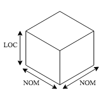

# JSCity
JavaScript projects visualised as Cities.

This project is under development and very limited feel free to add any issues, comments and improvements.

## The City Metaphor
Introduced by Wettel (2007), the [City Metaphor](https://www.inf.usi.ch/faculty/lanza/Downloads/Wett07b.pdf) proposes to analyse and view software systems as cities. The software system is represented as a city that can be traversed and interacted with, provinding the viewer a sense of locality to ease program comprehension.

The key point in conceiving a realistic software city is to map the information about the source code in meaningful ways in order to take the approach beyond beautiful pictures. It proposes several concepts that contributes to create the urban feeling, such as appropriate layouts, topology, and facilities to ease navigation and interaction.

## Metaphor applied to JavaScript
This project proposes its own way to translate JavaScript projects into the city metaphor, which allows the understanding of the usage of the language particularities.

### The buildings in the city
A block is the fundamental element of the metaphor, representing a city building. In the original metaphor, a block was mapped to represent a class of the system. However, JavaScript has several elements that must be represented and works differently. For instance the blocks could be: Functions, Classes, Objects, etc. Beyond that, functions might appear as [IFFEs](https://developer.mozilla.org/en-US/docs/Glossary/IIFE), [arrow functions](https://developer.mozilla.org/en-US/docs/Web/JavaScript/Reference/Functions/Arrow_functions), [closures](https://developer.mozilla.org/en-US/docs/Web/JavaScript/Closures), [function expressions](https://developer.mozilla.org/en-US/docs/web/JavaScript/Reference/Operators/function) and more.

Currently this project is limited to [simple function definitions](https://developer.mozilla.org/en-US/docs/Web/JavaScript/Guide/Functions) and its clojures.

#### Dimensions

Several metrics can be applied in order to define the measurements of a block. For this project, the block height is given the number of lines of code (LOC) of the element, while the width and length are defined by the call expressions count (CEC). Call expressions are call to functions.

#### Color
In order to differentiate the types of elements the project uses different colors for each kind of element.

#### Topology
The city topology is usually mapped to elements of the system hierarchy. Since there are no packages, namespaces or anything equivalent in JavaScript, the mapping limits itself to two clear levels: the project and the files.

The lowest layer represents the city limits as being the whole project (dark gray), and each element of the second layer represents a district, which translates to a file within the project (light gray).

Functions definitions that belogs to a file will appear inside its boundaries. Functions declarations that appear inside any function will be a block itself stacked in the parent function.